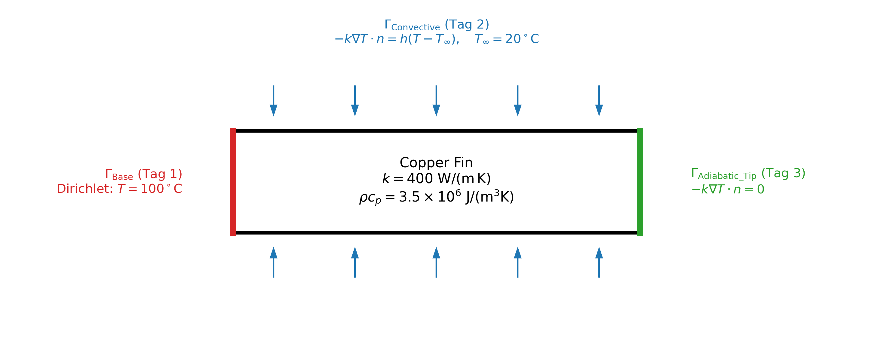
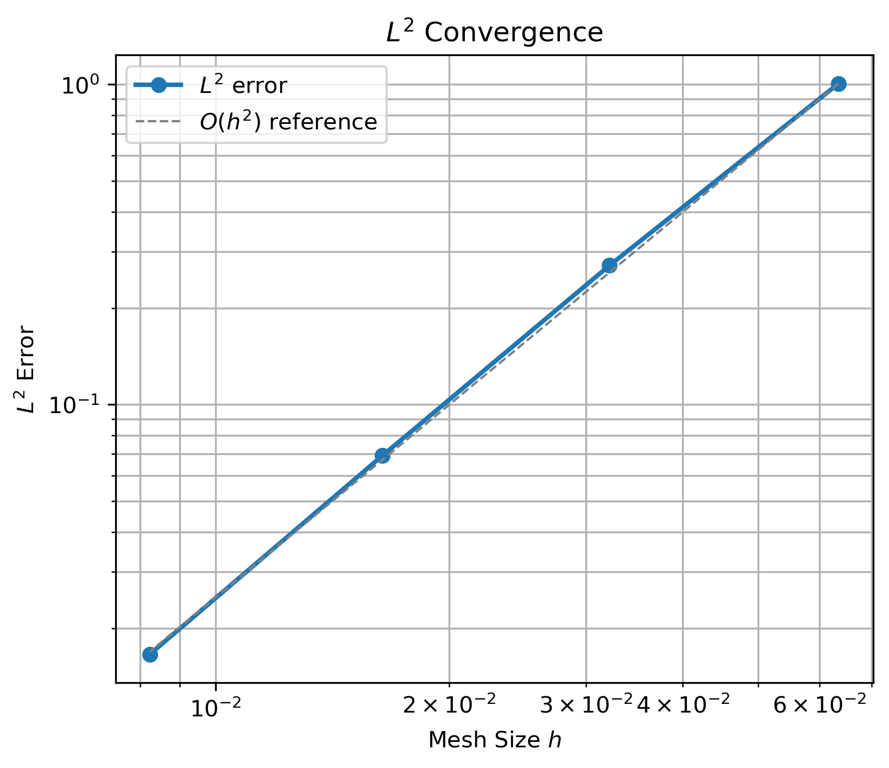
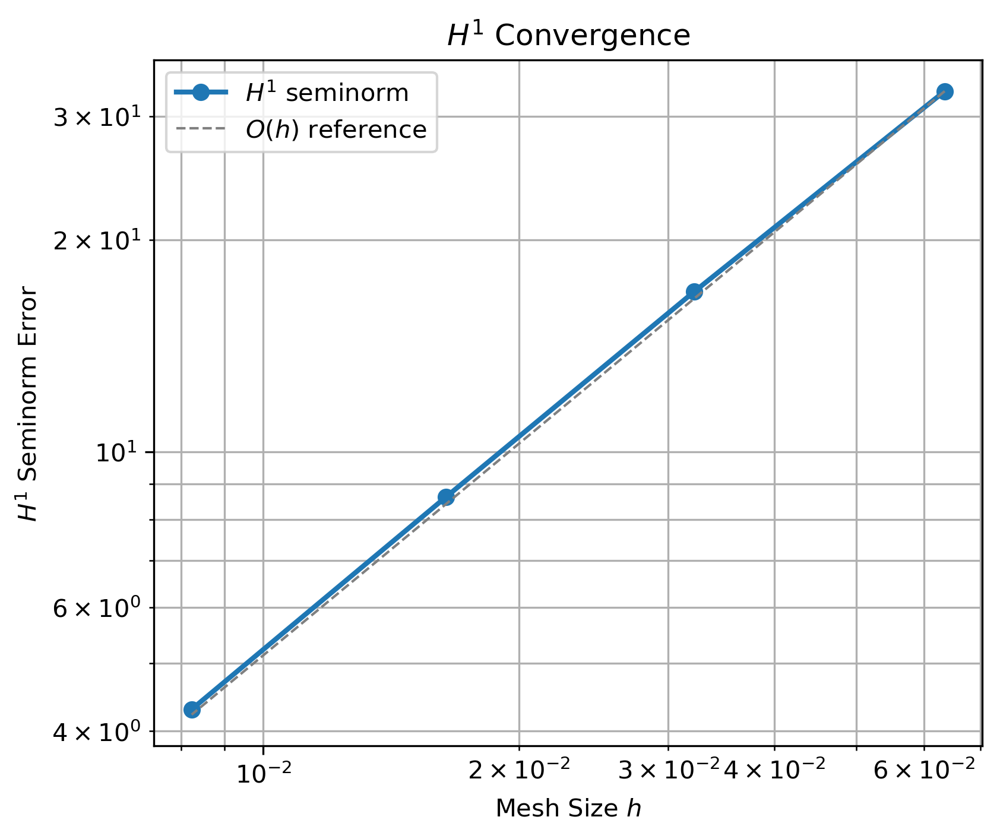
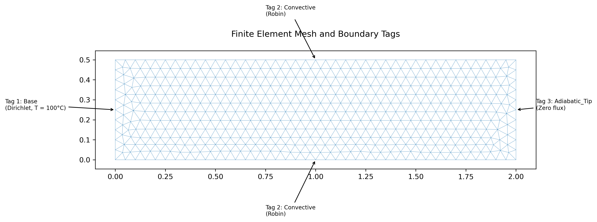
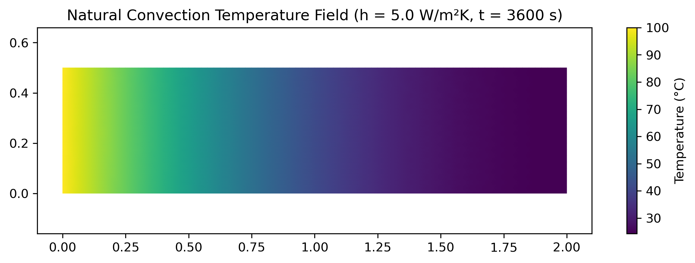
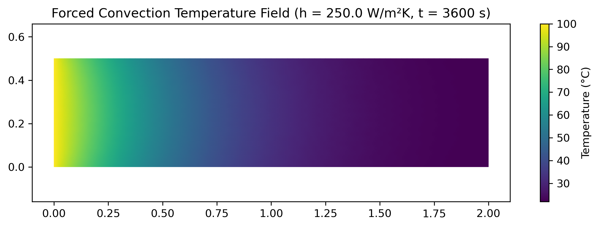
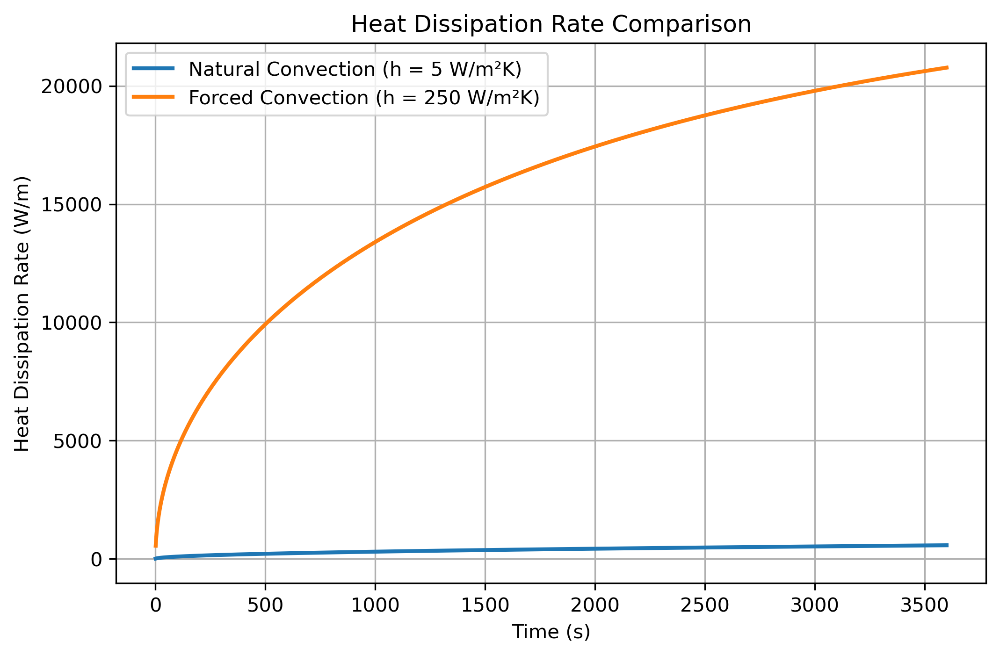

# Introduction

Thermal management is a critical consideration in modern engineering systems. Electronic devices, power converters, and computing hardware continuously generate heat that, if not removed effectively, can reduce performance, accelerate degradation, and shorten component lifetime. Among passive cooling technologies, extended-surface fins remain widely used: they increase the surface area available for heat exchange without requiring external power input, offering reliability and simplicity compared to active cooling approaches [@incropera2007].

This project develops a reusable finite element framework in Python (v3.11.15) for transient heat conduction in a two-dimensional copper cooling fin using FEniCSx (v0.10.0) [@baratta2023]. The workflow includes the generation of mesh via the Gmsh Python API (v4.15.2) [@geuzaine2009], the finite element discretization of the physical domain is done with continuous linear ($P_1$) elements. The discretised problem is then transiently solved using the PETSc (v3.25.1) backed linear algebra solver. A verification is then performed by the Method of Manufactured Solutions (MMS) [@roache2002] along with a mesh-convergence analysis and a comparative study of natural versus forced convection. The primary quantity of interest is the total convective heat dissipation rate $Q_\text{out}(t)$, which provides a direct measure of cooling performance across operating conditions.

# Physical Setup

The computational domain is a rectangular copper fin,

$$
\Omega = \{(x,y)\in\mathbb{R}^2 : 0 \le x \le L,\; 0 \le y \le H\},
$$

with $L = 2.0\ \text{m}$ and $H = 0.5\ \text{m}$. The material has thermal conductivity $k = 400\ \text{W/(m\,K)}$ and volumetric heat capacity $\rho c_p = 3.5\times10^6\ \text{J/(m}^3\text{K)}$.

The boundary decomposes into three physically distinct regions,

$$
\partial\Omega = \Gamma_\text{Base} \cup \Gamma_\text{Convective} \cup \Gamma_\text{Adiabatic\_Tip}.
$$

The heated base $\Gamma_\text{Base}$ at $x=0$ represents continuous thermal contact with a heat source and is held at a fixed temperature. The top and bottom surfaces form the convective boundary $\Gamma_\text{Convective}$, exchanging heat with the ambient air. The fin tip $\Gamma_\text{Adiabatic\_Tip}$ at $x=L$ is modelled as thermally insulated, as the tip area is small relative to the exposed surfaces. @fig-physical illustrates the geometry and boundary layout.

{#fig-physical width=82%}

The fin is initially at ambient temperature $T_\infty = 20^\circ\text{C}$. The boundary conditions are:

$$
T = T_\text{base} = 100^\circ\text{C} \quad \text{on } \Gamma_\text{Base},
$$

$$
-k\nabla T \cdot n = h(T - T_\infty) \quad \text{on } \Gamma_\text{Convective},
$$

$$
-k\nabla T \cdot n = 0 \quad \text{on } \Gamma_\text{Adiabatic\_Tip}.
$$

The adiabatic tip condition is the natural boundary condition of the weak form and requires no explicit enforcement in the solver.

Two convection coefficients are investigated: $h = 5\ \text{W/(m}^2\text{K)}$ (natural convection) and $h = 250\ \text{W/(m}^2\text{K)}$ (forced convection), representative values for air cooling drawn from @incropera2007. The total convective heat dissipation rate,

$$
Q_\text{out}(t) = \int_{\Gamma_\text{Convective}} h(T - T_\infty)\, ds,
$$

serves as the primary engineering quantity of interest throughout this study.

# Model and Weak Formulation

## Governing Equation and Temporal Discretization

Heat transport within the fin is governed by the transient heat equation,

$$
\rho c_p \frac{\partial T}{\partial t} - k\nabla^2 T = 0 \quad \text{in } \Omega \times (0, t_\text{end}],
$$

where $T(x,y,t)$ is the unknown temperature field, $k$ is the thermal conductivity, and $\rho c_p$ is the volumetric heat capacity. The first term represents the rate of thermal energy storage within the solid — how quickly the local temperature changes as heat accumulates or depletes — while the second term models conductive transport driven by spatial temperature gradients. No internal heat generation is assumed; energy enters and leaves the domain exclusively through the boundaries stated in Section 2.

The time derivative is discretized using the implicit Backward Euler method,

$$
\frac{\partial T}{\partial t} \approx \frac{T^{n+1} - T^n}{\Delta t},
$$

where $T^n$ denotes the known temperature field at time $t_n = n\Delta t$ and $T^{n+1}$ is the unknown at the next timestep. This scheme is first-order accurate in time and unconditionally stable for linear diffusion problems, making it a robust choice for the stiff thermal system considered here [@langtangen2016].

## Weak Formulation and Finite Element Discretization

Let $V = H^1(\Omega)$ and $v \in V$ be an arbitrary test function. Multiplying the semi-discrete equation by $v$, integrating over $\Omega$, applying Green's first identity to the diffusion term, and substituting the Robin condition on $\Gamma_\text{Convective}$ yields the variational problem: find $T^{n+1} \in V$ such that

$$
a(T^{n+1}, v) = L(v) \quad \forall\, v \in V,
$$

where

$$
a(T^{n+1}, v) = \int_\Omega \frac{\rho c_p}{\Delta t} T^{n+1} v\, dx + \int_\Omega k\nabla T^{n+1} \cdot \nabla v\, dx + \int_{\Gamma_\text{Convective}} h T^{n+1} v\, ds,
$$

$$
L(v) = \int_\Omega \frac{\rho c_p}{\Delta t} T^n v\, dx + \int_{\Gamma_\text{Convective}} h T_\infty v\, ds.
$$

The Dirichlet condition on $\Gamma_\text{Base}$ is enforced strongly through the finite element space and contributes no boundary integrals. The adiabatic tip condition on $\Gamma_\text{Adiabatic\_Tip}$ vanishes identically in the weak form and requires no explicit treatment. The domain is discretized using continuous first-order Lagrange ($P_1$) elements, for which theory predicts $\|e\|_{L^2} = O(h^2)$ and $|e|_{H^1} = O(h)$ for smooth solutions [@langtangen2016].

# Implementation and Solver Choices

The solver is implemented in Python using DOLFINx (FEniCSx). Geometry is generated programmatically through the Gmsh Python API, with three physical boundary tags used to identify the boundary regions:

```python
tag 1 -> Base
tag 2 -> Convective
tag 3 -> Adiabatic_Tip
```

The mesh is imported into DOLFINx using

```python
dolfinx.io.gmshio.model_to_mesh(...)
```

and the finite element space is defined as

```python
V = dolfinx.fem.functionspace(mesh, ("P", 1))
```

Material properties are represented using DOLFINx constants,

```python
k = dolfinx.fem.Constant(mesh, value)
```

allowing parameters to be modified without changing the variational formulation. The weak form is expressed in UFL and assembled automatically by DOLFINx.

Since the governing equation is linear and all material properties remain constant, the system matrix does not change between timesteps. The resulting sparse linear systems are solved using PETSc with direct LU factorization,

```python
ksp_type = "preonly"
pc_type  = "lu"
```

which provides a robust and efficient solution strategy for the problem sizes considered. Boundary regions are identified through facet tags, allowing the same solver implementation to be reused for all simulation scenarios without modification.

# Verification

Verification was performed using the Method of Manufactured Solutions (MMS), which tests whether the equations are solved correctly. A smooth analytical temperature field,

$$
T_\text{exact}(x,y,t) = 20 + 80\sin\!\left(\frac{\pi x}{L}\right)\sin\!\left(\frac{\pi y}{H}\right)e^{-t},
$$

satisfying homogeneous Dirichlet conditions on all boundaries, was prescribed. Substituting into the heat equation yields a source term $f_\text{MMS}$ that was supplied to the solver. Errors at the final simulation time were evaluated using

$$
\|e\|_{L^2} = \left(\int_\Omega (T_h - T_\text{exact})^2\, dx\right)^{1/2},
\qquad
|e|_{H^1} = \left(\int_\Omega |\nabla T_h - \nabla T_\text{exact}|^2\, dx\right)^{1/2}.
$$

This approach simultaneously exercises the transient term, diffusion operator, source term, boundary-condition enforcement, and finite element assembly, providing strong evidence of solver correctness.

# Mesh Convergence Study

Four systematically refined meshes were generated with characteristic element lengths $lc \in \{0.10,\, 0.05,\, 0.025,\, 0.0125\}$, using $h = 1/\sqrt{N_\text{cells}}$ as the mesh-size measure. All MMS runs used $\Delta t = 2.5\times10^{-4}\ \text{s}$ and $t_\text{end} = 0.2\ \text{s}$, keeping temporal errors negligible relative to spatial errors. Error norms at the final time are reported in @tbl-convergence, and experimental convergence rates in @tbl-rates.

| Mesh Size $h$ | $L^2$ Error | $H^1$ Error |
|:---:|---:|---:|
| $6.350 \times 10^{-2}$ | $1.006 \times 10^{0}$ | $3.257 \times 10^{1}$ |
| $3.217 \times 10^{-2}$ | $2.717 \times 10^{-1}$ | $1.688 \times 10^{1}$ |
| $1.641 \times 10^{-2}$ | $6.927 \times 10^{-2}$ | $8.616 \times 10^{0}$ |
| $8.233 \times 10^{-3}$ | $1.660 \times 10^{-2}$ | $4.297 \times 10^{0}$ |

: Mesh convergence results ($\Delta t = 2.5\times10^{-4}\ \text{s}$, $t_\text{end} = 0.2\ \text{s}$). {#tbl-convergence}

| Refinement Step | $L^2$ Rate | $H^1$ Rate |
|:---:|---:|---:|
| 1 | 1.926 | 0.967 |
| 2 | 2.031 | 0.999 |
| 3 | 2.070 | 1.009 |

: Experimental convergence rates. {#tbl-rates}

::: {#fig-convergence layout="[1,1]"}




Error norm vs. mesh size $h$ on a log-log scale (left: $L^2$ norm; right: $H^1$ seminorm). Dashed reference lines indicate the theoretical slopes $O(h^2)$ and $O(h)$.
:::

The observed rates closely match the theoretical predictions of $O(h^2)$ in $L^2$ and $O(h)$ in $H^1$ for $P_1$ elements. Both error norms decrease monotonically under refinement. Minor deviations are expected due to temporal discretization error from the Backward Euler scheme. The convergence results confirm that the solver is functioning correctly and is suitable for application to realistic scenarios.

\FloatBarrier

# Realistic Scenario Study

The verified solver was applied to compare natural and forced convection under otherwise identical conditions ($T_\text{base} = 100^\circ\text{C}$, $T_\infty = 20^\circ\text{C}$). Both simulations were advanced to $t_\text{end} = 3600\ \text{s}$ using $\Delta t = 1\ \text{s}$, long enough for the system to reach a well-developed steady state. The two cases differ only in convection coefficient: natural convection at $h = 5\ \text{W/(m}^2\text{K)}$ and forced convection at $h = 250\ \text{W/(m}^2\text{K)}$. The computational mesh and boundary tags are shown in @fig-mesh.

{#fig-mesh width=82%}

The quantity of interest $Q_\text{out}(t)$ is integrated in time to obtain the total thermal energy dissipated,

$$
E = \int_0^{t_\text{end}} Q_\text{out}(t)\, dt,
$$

computed numerically via the trapezoidal rule. @tbl-qoi reports the results for both cases. The final temperature distributions are shown in @fig-temps, and the transient heat dissipation histories in @fig-q-history.

| Case | $h$ (W/m²K) | Total Energy Dissipated $E$ (J/m) |
|---|---:|---:|
| Natural convection | 5 | $1.383 \times 10^6$ |
| Forced convection | 250 | $5.579 \times 10^7$ |

: Total thermal energy dissipated over $t_\text{end} = 3600\ \text{s}$. {#tbl-qoi}

::: {#fig-temps layout="[1,1]"}




Temperature distribution at $t = 3600\ \text{s}$ (left: natural convection $h = 5\ \text{W/m}^2\text{K}$; right: forced convection $h = 250\ \text{W/m}^2\text{K}$).
:::

{#fig-q-history width=78%}

Under natural convection, weak boundary cooling limits heat removal and the fin remains at elevated temperatures throughout the domain. Under forced convection, the higher convection coefficient substantially reduces surface thermal resistance, producing steeper temperature gradients near the heated base and a dramatically larger energy output. The improvement factor of $40.35\times$ in total dissipated energy quantifies the benefit of active cooling: forced convection removes energy rapidly enough that fin temperatures are substantially lower, reducing thermal stresses and improving component reliability.

# Conclusion

This project developed and verified a finite element framework for transient heat conduction in a two-dimensional copper cooling fin using FEniCSx. The key outcomes are summarised below.

- **Formulation.** The transient heat equation was discretized with continuous $P_1$ elements in space and the implicit Backward Euler method in time. The Robin boundary condition is incorporated naturally into the weak form; the Dirichlet base condition is enforced strongly, and the adiabatic tip is handled implicitly as the natural boundary condition.

- **Verification.** The Method of Manufactured Solutions confirmed optimal convergence: $O(h^2)$ in the $L^2$ norm and $O(h)$ in the $H^1$ seminorm, consistent with $P_1$ finite element theory. Both error norms decreased monotonically across all four mesh refinement levels.

- **Scenario study.** Increasing the convection coefficient from $5$ to $250\ \text{W/(m}^2\text{K)}$ yields a $40.35\times$ improvement in total thermal energy dissipated over one hour ($1.38\times10^6$ vs $5.58\times10^7\ \text{J/m}$), confirming forced convection as the clearly superior configuration.

- **Reproducibility.** The complete workflow — mesh generation via Gmsh, boundary tagging, assembly, time-stepping, and post-processing — is scripted and executable from a single command, with no manual preprocessing steps.

---

*I hereby declare that I wrote this report on my own and without the use of any other than the cited sources and tools, and all explanations that I copied directly or in their sense are marked as such.*

# References {.unnumbered}

::: {#refs}
:::

